# IPTU Data Pipeline - Neuro Tech Challenge

> **A comprehensive, production-ready data pipeline for IPTU (Property Tax) data processing, featuring a medallion architecture with PySpark support, data quality validation, and automated analytics.**

[](https://www.python.org/downloads/)
[](https://spark.apache.org/)
[](https://delta.io/)
[](https://github.com/pydeequ/pydeequ)

---

## Table of Contents

- [Overview](#overview)
  - [Principais Descobertas](#principais-descobertas)
- [Key Features](#key-features)
  - [Core Capabilities](#core-capabilities)
  - [Data Quality Framework](#data-quality-framework)
- [Architecture](#architecture)
  - [Medallion Architecture (Delta Lake)](#medallion-architecture-delta-lake)
  - [Processing Pipeline](#processing-pipeline)
- [Project Structure](#project-structure)
- [Installation](#installation)
  - [Prerequisites](#prerequisites)
  - [Step 1: Clone Repository](#step-1-clone-repository)
  - [Step 2: Install Dependencies](#step-2-install-dependencies)
  - [Step 3: Verify Installation](#step-3-verify-installation)
- [Quick Start](#quick-start)
  - [Run Full Pipeline (Pandas)](#run-full-pipeline-pandas)
  - [Run Full Pipeline (PySpark)](#run-full-pipeline-pyspark)
  - [Run with Docker (Spark Standalone)](#run-with-docker-spark-standalone)
- [Usage Guide](#usage-guide)
  - [Basic Usage](#basic-usage)
  - [Advanced Usage](#advanced-usage)
- [Configuration](#configuration)
  - [Environment Variables](#environment-variables)
  - [Configuration File](#configuration-file)
  - [Spark Configuration](#spark-configuration)
- [Data Quality](#data-quality)
  - [Validation Framework](#validation-framework)
  - [Quality Reports](#quality-reports)
  - [Running Quality Checks](#running-quality-checks)
- [Analytics & Visualizations](#analytics--visualizations)
  - [Análises e Respostas às Perguntas Principais](#análises-e-respostas-às-perguntas-principais)
  - [Todas as Visualizações Disponíveis](#todas-as-visualizações-disponíveis)
  - [Estrutura Completa das Análises](#estrutura-completa-das-análises)
- [Outputs](#outputs)
  - [Medallion Layers](#medallion-layers)
  - [Analysis Results](#analysis-results)
  - [Visualizations](#visualizations)
  - [Legacy Outputs](#legacy-outputs)
  - [Catalog](#catalog)
- [Advanced Features](#advanced-features)
  - [Delta Lake Features](#delta-lake-features)
  - [PyDeequ Integration](#pydeequ-integration)
  - [Catalog System](#catalog-system)
  - [Incremental Processing](#incremental-processing)
  - [Export Script](#export-script)
- [Next Steps](#next-steps)

---

## Overview

This project implements an enterprise-grade data pipeline for processing IPTU (Imposto Predial e Territorial Urbano) tax data from Recife, Brazil, covering years 2020-2024. Built on Python 3.11+, it features:

- **Medallion Architecture**: Raw → Bronze → Silver → Gold data layers
- **Dual Engine Support**: Pandas (default) and PySpark (distributed processing)
- **Data Quality Framework**: Automated validation with PyDeequ
- **Delta Lake Integration**: ACID transactions and schema evolution
- **Comprehensive Analytics**: Volume, distribution, age, value, and evolution analysis
- **Interactive Dashboards**: Plotly-powered visualizations
- **Orchestration**: Apache Airflow DAGs for automated workflows

### Principais Descobertas

O pipeline processou e analisou **1.637.779 imóveis** do IPTU de Recife:

- **Volume**: Distribuição completa por tipo de uso, bairro, e ano (2020-2024)
- **Idade**: Inventário predominantemente de meia-idade (21-50 anos de construção)
- **Valor**: DOIS IRMAOS, MONTEIRO e GUABIRABA são os bairros com maior valor médio de IPTU
- **Evolução**: Análise detalhada da evolução de bairros em quantidade e valor

Todas as análises estão disponíveis em `data/gold/analyses/` e visualizações em `data/gold/plots/`.

---

## Key Features

### Core Capabilities

| Feature | Description | Status |
|---------|-------------|--------|
| **Multi-Format Support** | CSV (2020-2023) and JSON (2024) | ✅ |
| **Schema Evolution** | Automatic handling of schema changes between years | ✅ |
| **Incremental Processing** | Add new years without reprocessing entire dataset | ✅ |
| **Data Quality Checks** | 7-layer validation with PyDeequ integration | ✅ |
| **Medallion Architecture** | Raw → Bronze → Silver → Gold layers | ✅ |
| **Delta Lake** | ACID transactions, time travel, column mapping | ✅ |
| **Distributed Processing** | PySpark with Spark 3.4+ support | ✅ |
| **Automated Analytics** | Volume, distribution, and trend analysis | ✅ |
| **Interactive Dashboards** | Plotly and Matplotlib visualizations | ✅ |
| **Orchestration** | Apache Airflow DAG integration | ✅ |
| **Catalog System** | Centralized metadata tracking | ✅ |
| **Docker Support** | Containerized Spark environment | ✅ |

### Data Quality Framework

- **PyDeequ Integration**: AWS Deequ automated data quality checks
- **Multi-Layer Validation**: Structure, completeness, uniqueness, business rules
- **Automated Reports**: JSON and CSV validation reports
- **Column Profiling**: Statistical analysis per column
- **Anomaly Detection**: Automated detection of data quality issues
- **Error Tracking**: Comprehensive error and warning logs

---

## Architecture

### Medallion Architecture (Delta Lake)

The pipeline follows a **medallion architecture** with four data layers:

```
┌─────────────────────────────────────────────────────────────────┐
│                     RAW LAYER (data/raw/)                       │
│  • Source CSV/JSON files                                        │
│  • No processing applied                                        │
│  • Immutable source of truth                                    │
│  • Cataloged with metadata (MD5, size, discovery date)          │
└─────────────────────────────────────────────────────────────────┘
                                  ↓
┌─────────────────────────────────────────────────────────────────┐
│                   BRONZE LAYER (data/bronze/)                   │
│  • Cleaned and cataloged data                                   │
│  • Normalized column names                                      │
│  • Standardized data types                                      │
│  • String trimming and categorical optimization                 │
│  • Partitioned by year                                          │
│  • Delta/Parquet format                                         │
│  • PyDeequ quality checks                                       │
└─────────────────────────────────────────────────────────────────┘
                                  ↓
┌─────────────────────────────────────────────────────────────────┐
│                   SILVER LAYER (data/silver/)                   │
│  • Consolidated multi-year dataset                              │
│  • Unified schema across all years                              │
│  • Time-series data ready for analytics                         │
│  • Deduplication applied                                        │
│  • Delta/Parquet format                                         │
└─────────────────────────────────────────────────────────────────┘
                                  ↓
┌─────────────────────────────────────────────────────────────────┐
│                    GOLD LAYER (data/gold/)                      │
│  • Business-ready analytics                                     │
│  • Volume analysis (total, by type, by neighborhood)            │
│  • Age distribution analysis (construction age)                 │
│  • Tax value analysis (by neighborhood, trends)                 │
│  • Age-value relationship analysis                              │
│  • Neighborhood evolution analysis                              │
│  • Analysis results (CSV)                                       │
│  • Visualizations (PNG, HTML) - 8 plots + HTML report           │
│  • Dashboard reports                                            │
│  • Year-over-year trends                                        │
└─────────────────────────────────────────────────────────────────┘
```

### Processing Pipeline

```
┌──────────┐      ┌──────────────┐      ┌──────────────┐      ┌──────────────┐
│  SOURCE  │  →   │  INGESTION   │  →   │  VALIDATION  │  →   │  TRANSFORM   │
│  FILES   │      │   (Raw)      │      │  (Bronze)    │      │  (Silver)    │
└──────────┘      └──────────────┘      └──────────────┘      └──────────────┘
                                                                    ↓
┌──────────┐      ┌──────────────┐      ┌──────────────┐      ┌──────────────┐
│EXPORT FOR│  ←   │ DASHBOARD    │  ←   │  ANALYSIS    │  ←   │  CONSOLIDATE │
│SHARING   │      │  (Gold)      │      │   (Gold)     │      │   (Silver)   │
└──────────┘      └──────────────┘      └──────────────┘      └──────────────┘
```

---

## Project Structure

```
neuro_tech/
├── data/                                    # Data directory (gitignored)
│   ├── raw/                                 # Raw layer: source files
│   │   ├── iptu_2020/iptu_2020.csv
│   │   ├── iptu_2021/iptu_2021.csv
│   │   ├── iptu_2022/iptu_2022.csv
│   │   ├── iptu_2023/iptu_2023.csv
│   │   └── iptu_2024_json/iptu_2024_json.json
│   ├── bronze/                              # Bronze layer: cleaned data
│   │   ├── iptu_2020/                       # Delta/Parquet, partitioned
│   │   ├── iptu_2021/
│   │   ├── iptu_2022/
│   │   ├── iptu_2023/
│   │   └── iptu_2024/
│   ├── silver/                              # Silver layer: consolidated
│   │   └── iptu_silver_consolidated/        # Delta/Parquet
│   ├── gold/                                # Gold layer: analytics
│   │   ├── analyses/                        # Analysis results (CSV)
│   │   ├── plots/                           # Visualizations (PNG, HTML)
│   │   ├── gold_summary_by_neighborhood/    # Aggregations
│   │   ├── gold_summary_by_year_type/
│   │   └── gold_year_over_year_trends/
│   └── catalog/                             # Central catalog
│       ├── data_catalog.json                # Human-readable catalog
│       ├── data_catalog.parquet             # Queryable catalog
│       └── data_catalog_delta/              # Delta catalog table
│
├── src/iptu_pipeline/                       # Main source code
│   ├── __init__.py
│   ├── config.py                            # Configuration management
│   ├── engine.py                            # DataEngine abstraction
│   ├── dashboard.py                         # Dashboard generation
│   ├── visualizations.py                    # Plot generation
│   ├── orchestration.py                     # Prefect orchestration
│   ├── airflow_dag.py                       # Airflow DAG
│   │
│   ├── pipelines/                           # Pipeline modules
│   │   ├── __init__.py
│   │   ├── main_pipeline.py                 # Main orchestration
│   │   ├── ingestion.py                     # Data ingestion
│   │   ├── transformation.py                # Data transformation
│   │   └── analysis.py                      # Data analysis
│   │
│   └── utils/                               # Utilities
│       ├── __init__.py
│       ├── logger.py                        # Logging system
│       ├── data_quality.py                  # Basic validation
│       ├── medallion_quality.py             # PyDeequ validation
│       ├── raw_catalog.py                   # Catalog system
│       └── column_matcher.py                # Schema matching
│
├── scripts/                                 # Utility scripts
│   └── generate_plots.py                    # Standalone plot generator
│
├── notebooks/                               # Jupyter notebooks
│   ├── pipeline_execution.ipynb            # Pipeline walkthrough
│   └── visualizations.ipynb                # Visualization exploration
│
├── dags/                                    # Airflow DAGs
│   └── iptu_pipeline_dag.py                # Deployable DAG
│
├── outputs/                                 # Legacy outputs
│   ├── validation_report.csv
│   ├── validation_errors.csv
│   └── medallion_validation_report.json
│
├── logs/                                    # Application logs
│
├── docker-compose.yml                       # Spark cluster setup
├── docker-compose.standalone.yml            # Standalone Spark
│
├── main.py                                  # Entry point
├── export_refined_dataset.py               # Export script
├── test_pydeequ.py                         # PyDeequ tests
├── test_delta.py                           # Delta Lake tests
│
├── pyproject.toml                          # Project metadata
├── requirements-pyspark.txt                # PySpark dependencies
├── requirements.txt                        # Base dependencies
│
├── README.md                               # This file
├── ARCHITECTURE.md                         # Architecture details
├── DOCKER_SETUP.md                         # Docker guide
└── .gitignore
```

---

## Installation

### Prerequisites

- **Python**: 3.11 or higher
- **Java** (for PySpark): 8 or 11
- **uv** (recommended) or pip/conda
- **Docker** (optional, for Spark)

### Step 1: Clone Repository

```bash
git clone <repository-url>
cd neuro_tech
```

### Step 2: Install Dependencies

**Option A: Using uv (Recommended)**

```bash
# Install uv if not already installed
curl -LsSf https://astral.sh/uv/install.sh | sh

# Install base dependencies
uv sync

# Install PySpark dependencies (optional, for distributed processing)
uv sync --extra pyspark
```

**Option B: Using pip**

```bash
# Create virtual environment
python -m venv .venv
source .venv/bin/activate  # On Windows: .venv\Scripts\activate

# Install base dependencies
pip install -e .

# Install PySpark dependencies (optional)
pip install -r requirements-pyspark.txt
```

**Option C: Using conda**

```bash
# Create conda environment
conda create -n neuro-tech python=3.11
conda activate neuro-tech

# Install dependencies
pip install -e .
pip install -r requirements-pyspark.txt
```

### Step 3: Verify Installation

```bash
python -c "from iptu_pipeline import config; print(f'Engine: {config.settings.DATA_ENGINE}')"
```

Expected output: `Engine: pandas`

---

## Quick Start

### Run Full Pipeline (Pandas)

```bash
python main.py
```

This will:
1. Load data from `data/raw/`
2. Catalog files in `data/catalog/`
3. Process through Bronze → Silver → Gold layers
4. Generate analyses and visualizations
5. Save outputs to `data/gold/`

### Run Full Pipeline (PySpark)

```bash
# Windows PowerShell
$env:IPTU_DATA_ENGINE="pyspark"
python main.py

# Linux/Mac
export IPTU_DATA_ENGINE=pyspark
python main.py
```

**Example Output:**

```text
INFO - Starting IPTU Data Pipeline
INFO - Running pipeline (direct execution mode)
INFO - Local mode optimized: 16 cores, 32 shuffle partitions, 4g driver memory
INFO - Delta Lake + PyDeequ configured: JARs loaded + extensions set
INFO - Creating Spark session...
INFO - [OK] Raw files cataloged: 5 files
INFO - [BRONZE LAYER] Cleaning and Cataloging Raw Data
INFO - Processing year 2020 to bronze layer
INFO - [OK] Loaded 2020: 403,915 rows, 32 columns
INFO - [PASS] Validation PASSED for year 2020
INFO - [OK] Year 2020 saved to bronze layer
...
INFO - [SILVER LAYER] Consolidating Bronze Data
INFO - Consolidated 1,637,779 rows from 5 years
INFO - [OK] Silver layer saved: 1,637,779 rows, 37 columns
...
INFO - [GOLD LAYER] Generating Analytics and Visualizations
INFO - [OK] Generated 12 plots
INFO - [OK] HTML report created: data/gold/plots/visualizations_report.html
```

> **Full Output**: See [`example_run.txt`](example_run.txt) for the complete execution log with detailed processing steps.

### Run with Docker (Spark Standalone)

```bash
# Using standalone Spark (simplest)
docker-compose -f docker-compose.standalone.yml up --build

# Using Spark cluster
docker-compose up --build
```

Access Spark UI: http://localhost:4040

---

## Usage Guide

### Basic Usage

#### 1. Process All Years

```python
from iptu_pipeline.pipelines.main_pipeline import IPTUPipeline

pipeline = IPTUPipeline(engine='pandas')  # or 'pyspark'
consolidated_df = pipeline.run_full_pipeline(
    years=None,              # None = all years
    save_consolidated=True,
    run_analysis=True,
    incremental=False
)
```

#### 2. Process Specific Years

```python
pipeline = IPTUPipeline(engine='pyspark')
consolidated_df = pipeline.run_full_pipeline(
    years=[2020, 2021, 2022],
    save_consolidated=True,
    run_analysis=True,
    incremental=False
)
```

#### 3. Incremental Processing (Add New Years)

```python
# First run: process 2020-2023
pipeline.run_full_pipeline(years=[2020, 2021, 2022, 2023], incremental=False)

# Later: add 2024 without reprocessing previous years
pipeline.run_full_pipeline(years=[2024], incremental=True)
```

#### 4. Generate Visualizations

```python
from iptu_pipeline.visualizations import generate_plots_from_analysis_results

# Generate all plots
plot_files = generate_plots_from_analysis_results()
print(plot_files)
```

#### 5. Create Dashboard

```python
from iptu_pipeline.dashboard import IPTUDashboard
from iptu_pipeline.config import SILVER_DIR
from iptu_pipeline.engine import get_engine

# Load silver layer data
engine = get_engine()
if engine.engine_type == "pyspark":
    df = engine.read_parquet(SILVER_DIR / "iptu_silver_consolidated")
    df = engine.to_pandas(df)
else:
    import pandas as pd
    df = pd.read_parquet(SILVER_DIR / "iptu_silver_consolidated/data.parquet")

# Generate dashboard
dashboard = IPTUDashboard(df=df)
dashboard.generate_dashboard()
dashboard.generate_summary_report()
```

### Advanced Usage

#### Export Refined Dataset

```bash
python export_refined_dataset.py --output iptu_refined.parquet --engine pyspark
```

This creates a single Parquet file for sharing, with:
- Duplicates removed
- Metadata columns filtered
- Compatible timestamp formats
- All years consolidated

#### Run Airflow DAG

```bash
# Start Airflow (see AIRFLOW_SETUP.md)
airflow webserver --port 8080
airflow scheduler

# Trigger DAG
airflow dags trigger iptu_medallion_pipeline
```

#### Custom Configuration

```python
from iptu_pipeline.config import settings

# Modify settings
settings.DATA_ENGINE = "pyspark"
settings.MIN_ROWS_PER_YEAR = 500
settings.MAX_NULL_PERCENTAGE = 40.0

# Run pipeline with custom settings
pipeline = IPTUPipeline(engine='pyspark')
pipeline.run_full_pipeline()
```

---

## Configuration

### Environment Variables

The pipeline uses `pydantic-settings` for configuration. Set environment variables with prefix `IPTU_`:

```bash
# Windows PowerShell
$env:IPTU_DATA_ENGINE="pyspark"
$env:IPTU_MIN_ROWS_PER_YEAR="500"

# Linux/Mac
export IPTU_DATA_ENGINE=pyspark
export IPTU_MIN_ROWS_PER_YEAR=500
```

### Configuration File

Edit `src/iptu_pipeline/config.py`:

```python
class Settings(BaseSettings):
    # Base directories
    BASE_DIR: Path = ...
    DATA_DIR: Path = ...
    OUTPUT_DIR: Path = ...
    
    # Medallion layers
    RAW_DIR: Path = ...
    BRONZE_DIR: Path = ...
    SILVER_DIR: Path = ...
    GOLD_DIR: Path = ...
    CATALOG_DIR: Path = ...
    
    # Data years
    CSV_YEARS: List[int] = [2020, 2021, 2022, 2023]
    JSON_YEARS: List[int] = [2024]
    
    # Quality thresholds
    MIN_ROWS_PER_YEAR: int = 100
    MAX_NULL_PERCENTAGE: float = 50.0
    
    # Processing engine
    DATA_ENGINE: str = "pandas"  # or "pyspark"
```

### Spark Configuration

For PySpark, customize in `src/iptu_pipeline/engine.py`:

```python
builder = SparkSession.builder \
    .appName("IPTU_Pipeline") \
    .config("spark.driver.memory", "16g") \
    .config("spark.executor.memory", "16g") \
    .config("spark.sql.shuffle.partitions", "200")
```

---

## Data Quality

### Validation Framework

The pipeline implements **multi-layer data quality validation**:

#### Layer 1: Basic Validation (Bronze)
- Structure checks (row count, column count)
- Data type validation
- Null value percentage
- Duplicate detection
- Business rules (CEP, city, state)

#### Layer 2: PyDeequ Validation
- **Completeness**: Check for null values
- **Unique values**: Detect duplicates
- **Uniqueness**: Primary key constraints
- **Range checks**: Value constraints
- **Column profiling**: Statistical analysis
- **Anomaly detection**: Automated issue detection

#### Layer 3: Medallion Validation (Silver/Gold)
- Year consistency across layers
- Schema evolution compatibility
- Deduplication verification
- Aggregation accuracy

### Quality Reports

Reports are generated at multiple stages:

1. **data/catalog/data_catalog.json**: Raw file catalog
2. **outputs/validation_report.csv**: Per-year validation summary
3. **outputs/validation_errors.csv**: Detailed errors/warnings
4. **outputs/medallion_validation_report.json**: Layer-wise validation

### Running Quality Checks

```python
from iptu_pipeline.utils.medallion_quality import MedallionDataQuality
from iptu_pipeline.engine import get_engine

engine = get_engine('pyspark')
quality = MedallionDataQuality(engine.spark)

# Validate bronze layer
df_bronze = engine.read_parquet(BRONZE_DIR / "iptu_2020")
results = quality.validate_bronze_layer(df_bronze, year=2020)

# Validate silver layer
df_silver = engine.read_parquet(SILVER_DIR / "iptu_silver_consolidated")
results = quality.validate_silver_layer(df_silver, year=None)
```

---

## Analytics & Visualizations

Este pipeline gera análises abrangentes e visualizações automáticas sobre o inventário de imóveis do IPTU de Recife. As análises cobrem:

- **Volume**: Distribuição total de imóveis por tipo, bairro, ano e construção
- **Idade**: Análise da distribuição por faixas de idade de construção
- **Valor**: Bairros com maiores valores de IPTU e relação idade × valor
- **Evolução**: Crescimento de bairros em quantidade e valor ao longo do tempo

**Resultados:**
- **12 visualizações interativas** em formato HTML (Plotly) + PNG (alta qualidade)
- **20+ análises** detalhadas (CSV)
- **1 relatório HTML** interativo com todas as visualizações e tabelas

Todas as análises são geradas automaticamente ao executar o pipeline e salvos em `data/gold/analyses/` e `data/gold/plots/`.

### Análises e Respostas às Perguntas Principais

O pipeline realiza análises abrangentes que respondem às perguntas principais sobre o inventário de imóveis do IPTU:

---

#### 1. Volume: Qual o total de imóveis e como o inventário está distribuído fisicamente?

**Resposta:** O dataset consolidado contém **1.637.779 imóveis** totais (acumulado de 2020-2024).

**Distribuição por Tipo de Uso:**
- Análise completa disponível em: `data/gold/analyses/volume_analysis/volume_by_type.csv`
- Visualização interativa: [`data/gold/plots/volume_by_type.html`](data/gold/plots/volume_by_type.html)

**Distribuição por Bairro:**
- Top 20 bairros com mais imóveis: `data/gold/analyses/volume_analysis/volume_by_neighborhood.csv`
- Visualização interativa: [`data/gold/plots/top_neighborhoods.html`](data/gold/plots/top_neighborhoods.html)

**Distribuição Temporal:**
- Volume por ano (2020-2024): `data/gold/analyses/volume_analysis/volume_by_year.csv`
- Visualização interativa: [`data/gold/plots/volume_by_year.html`](data/gold/plots/volume_by_year.html)

**Distribuição Combinada (Ano × Tipo):**
- Análise cruzada ano/tipo: `data/gold/analyses/volume_analysis/volume_by_year_type.csv`
- Visualização interativa: [`data/gold/plots/volume_by_year_type.html`](data/gold/plots/volume_by_year_type.html)

**Distribuição por Tipo de Construção:**
- Análise: `data/gold/analyses/distribution_analysis/distribution_by_construction.csv`
- Visualização interativa: [`data/gold/plots/distribution_by_construction.html`](data/gold/plots/distribution_by_construction.html)

---

#### 2. Idade: Como o inventário está distribuído em termos de idade de construção?

**Resposta:** A distribuição por faixas de idade mostra que:
- **41-50 anos**: 467.333 imóveis (maior faixa)
- **21-30 anos**: 273.655 imóveis
- **11-20 anos**: 231.864 imóveis
- **60+ anos**: 203.572 imóveis
- **31-40 anos**: 176.620 imóveis
- **51-60 anos**: 174.710 imóveis
- **0-10 anos**: 110.025 imóveis

**Análise Completa:**
- Distribuição por faixas: `data/gold/analyses/age_analysis/age_distribution_by_range.csv`
- Estatísticas: `data/gold/analyses/age_analysis/age_statistics.csv`
- Distribuição temporal: [`data/gold/plots/temporal_distribution.html`](data/gold/plots/temporal_distribution.html)
- Distribuição por idade: [`data/gold/plots/age_distribution.html`](data/gold/plots/age_distribution.html)

A maioria dos imóveis tem entre 21-50 anos de construção, indicando um inventário predominantemente de meia-idade.

---

#### 3. Valor (R$): Quais os bairros com imóveis mais valiosos? Há relação direta entre idade e valor?

**Bairros com Maior Valor Médio de IPTU:**

| Bairro | Valor Médio IPTU (R$) | Total (R$) | Qtd. Imóveis |
|--------|----------------------|-----------|--------------|
| DOIS IRMAOS | 8.199,33 | 2.951.757,86 | 360 |
| MONTEIRO | 4.431,75 | 34.580.948,84 | 7.803 |
| GUABIRABA | 4.223,49 | 9.000.253,52 | 2.131 |
| JAQUEIRA | 3.854,44 | 11.320.488,43 | 2.937 |
| ILHA DO RETIRO | 3.816,16 | 18.580.887,28 | 4.869 |

**Análise Completa:**
- Top 20 bairros por valor médio: `data/gold/analyses/tax_value_analysis/avg_tax_by_neighborhood_top20.csv`
- Visualização interativa: [`data/gold/plots/top_tax_neighborhoods.html`](data/gold/plots/top_tax_neighborhoods.html)
- Tendências de valor (Boxplot): [`data/gold/plots/tax_trends.html`](data/gold/plots/tax_trends.html)

**Relação Idade × Valor:**

A análise mostra uma **relação inversa interessante**:
- **0-10 anos**: Valor médio IPTU = R$ 2.126,84 (imóveis mais novos, valor médio)
- **11-20 anos**: Valor médio IPTU = R$ 2.991,03 (pico de valor)
- **21-30 anos**: Valor médio IPTU = R$ 2.172,92
- **31-40 anos**: Valor médio IPTU = R$ 1.521,58
- **41-50 anos**: Valor médio IPTU = R$ 786,38 (maior quantidade, menor valor médio)
- **50+ anos**: Valor médio IPTU = R$ 1.028,19

**Conclusão:** Não há relação direta simples. Imóveis de **11-20 anos** têm o maior valor médio, enquanto imóveis **41-50 anos** (a faixa mais numerosa) têm menor valor médio. Isso sugere que fatores além da idade (localização, padrão de construção, infraestrutura) influenciam fortemente o valor.

**Análise Completa:**
- Relação idade-valor: `data/gold/analyses/age_value_analysis/age_value_relationship.csv`
- Visualização interativa: [`data/gold/plots/age_value_relationship.html`](data/gold/plots/age_value_relationship.html)

---

#### 4. Evolução: Quais bairros apresentam maior evolução em número de imóveis? E em relação a valor?

**Bairros com Maior Crescimento em Quantidade:**

A análise comparativa entre o primeiro e último ano mostra que muitos bairros apresentaram **redução** significativa no número de registros (possivelmente devido a consolidações, alterações administrativas ou melhoria na qualidade dos dados). Para identificar crescimento real, a análise foca em bairros que mantiveram consistência nos dados.

**Top Crescimentos:**
- Análise completa: `data/gold/analyses/evolution_analysis/top_growth_quantity.csv`
- Análise por bairro: `data/gold/analyses/evolution_analysis/neighborhood_evolution.csv`
- Visualização interativa: [`data/gold/plots/neighborhood_growth_quantity.html`](data/gold/plots/neighborhood_growth_quantity.html)

**Bairros com Maior Crescimento em Valor:**
- Análise completa: `data/gold/analyses/evolution_analysis/top_growth_value.csv`
- Visualização interativa: [`data/gold/plots/neighborhood_growth_value.html`](data/gold/plots/neighborhood_growth_value.html)

**Tendências Anuais:**
- Estatísticas por ano: `data/gold/analyses/tax_value_analysis/tax_stats_by_year.csv`
- Valores de propriedade: `data/gold/analyses/tax_value_analysis/property_value_by_year.csv`
- Visualização interativa: [`data/gold/plots/tax_trends.html`](data/gold/plots/tax_trends.html)

**Observação:** A evolução precisa ser analisada considerando que mudanças administrativas, consolidações de registros e melhorias na qualidade dos dados podem afetar as comparações ano a ano.

---

### Todas as Visualizações Disponíveis

Todas as visualizações são geradas automaticamente em formato HTML interativo e PNG (alta qualidade, 2x scale) e salvas em `data/gold/plots/`:

#### 1. Análise de Volume

**Volume por Ano** - Gráfico de barras do total de imóveis por ano

[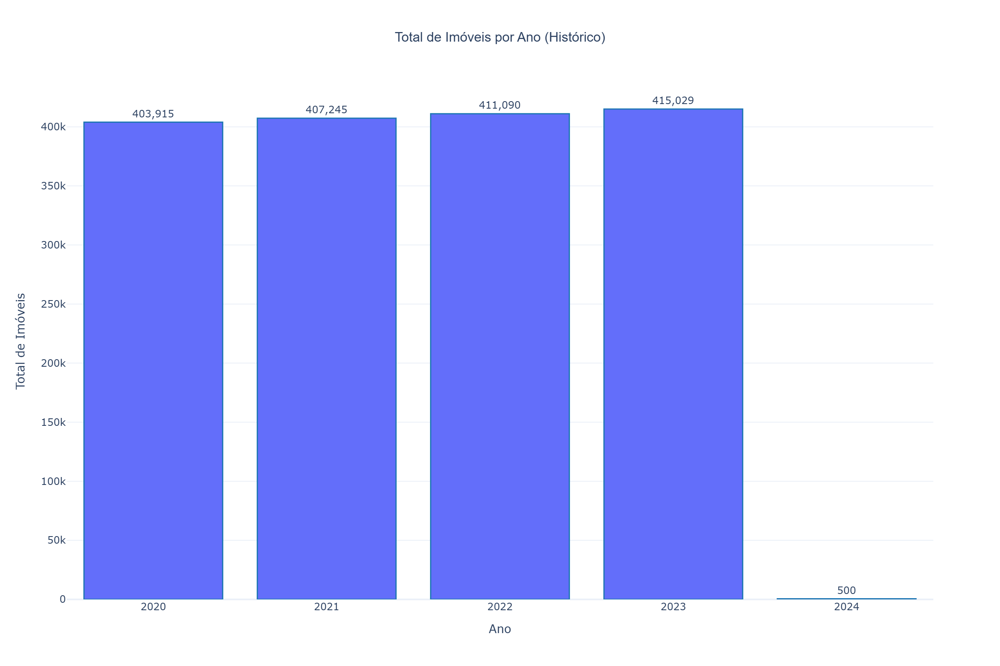](data/gold/plots/volume_by_year.html)

**Volume por Tipo** - Gráfico de pizza + barras por tipo de uso

[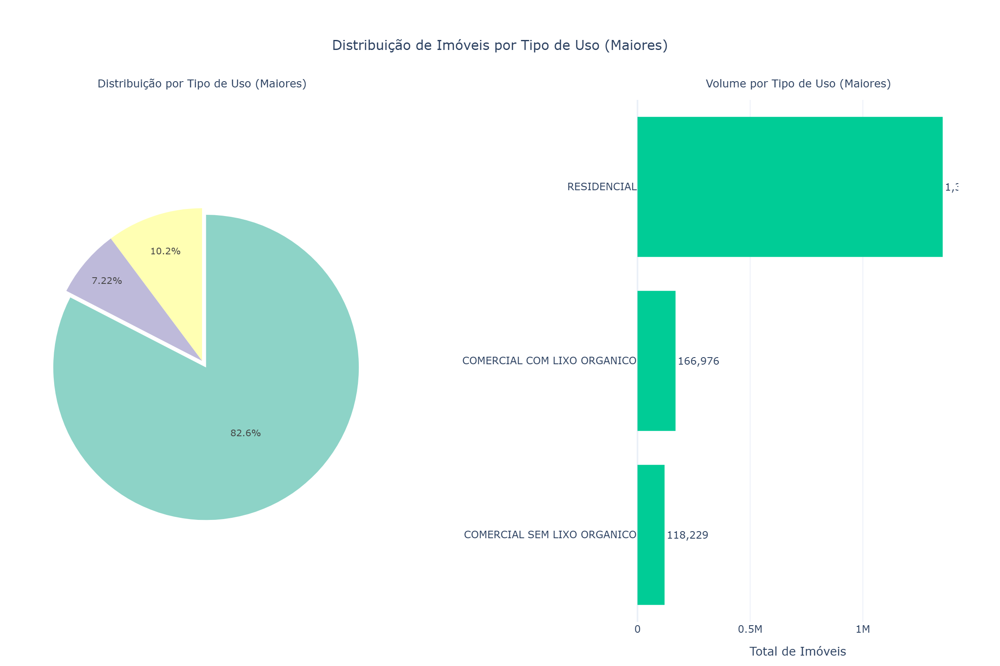](data/gold/plots/volume_by_type.html)

**Top Bairros** - Top 20 bairros por quantidade de imóveis

[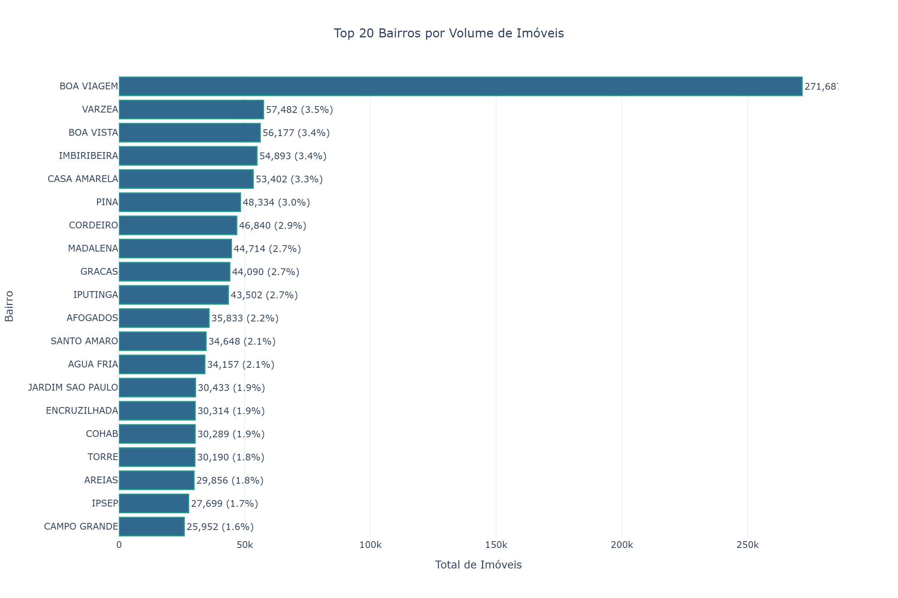](data/gold/plots/top_neighborhoods.html)

**Volume Ano × Tipo** - Gráfico de área empilhada mostrando evolução

[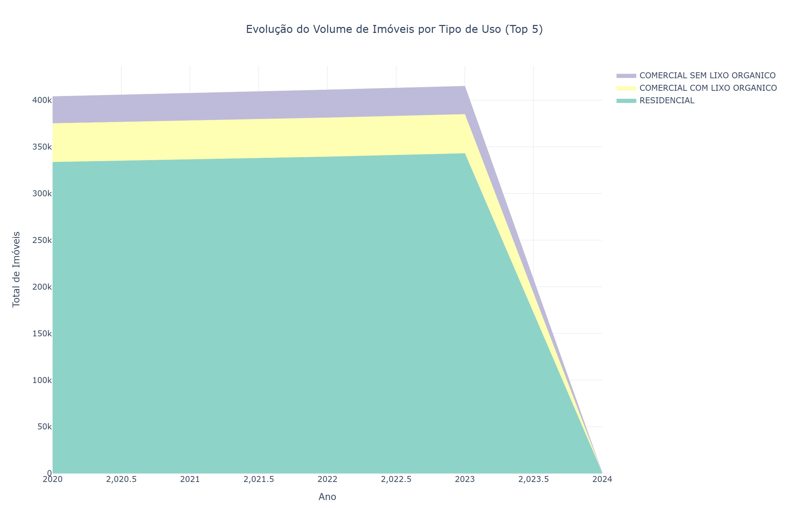](data/gold/plots/volume_by_year_type.html)

**Distribuição por Construção** - Gráfico de barras por tipo de construção

[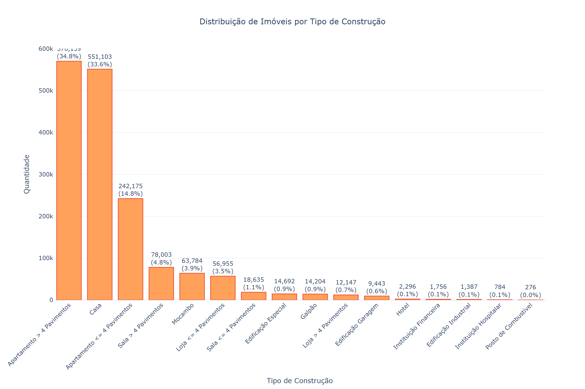](data/gold/plots/distribution_by_construction.html)

**Distribuição Temporal** - Timeline mostrando distribuição ao longo do tempo

[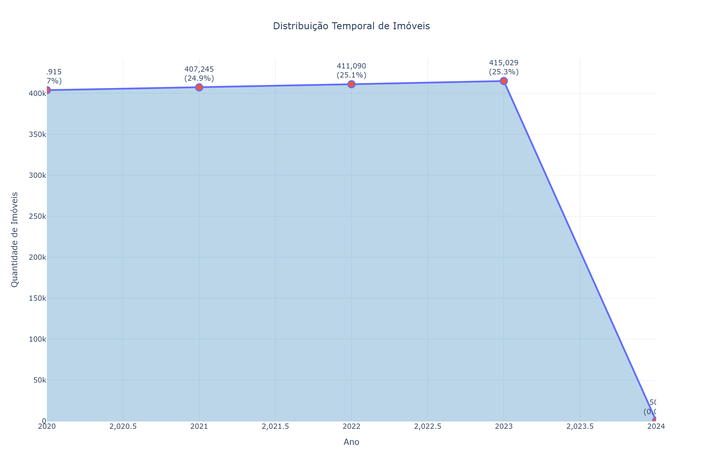](data/gold/plots/temporal_distribution.html)

#### 2. Análise de Valores de IPTU

**Tendências de IPTU (Boxplot)** - Distribuição de valores de IPTU por ano

[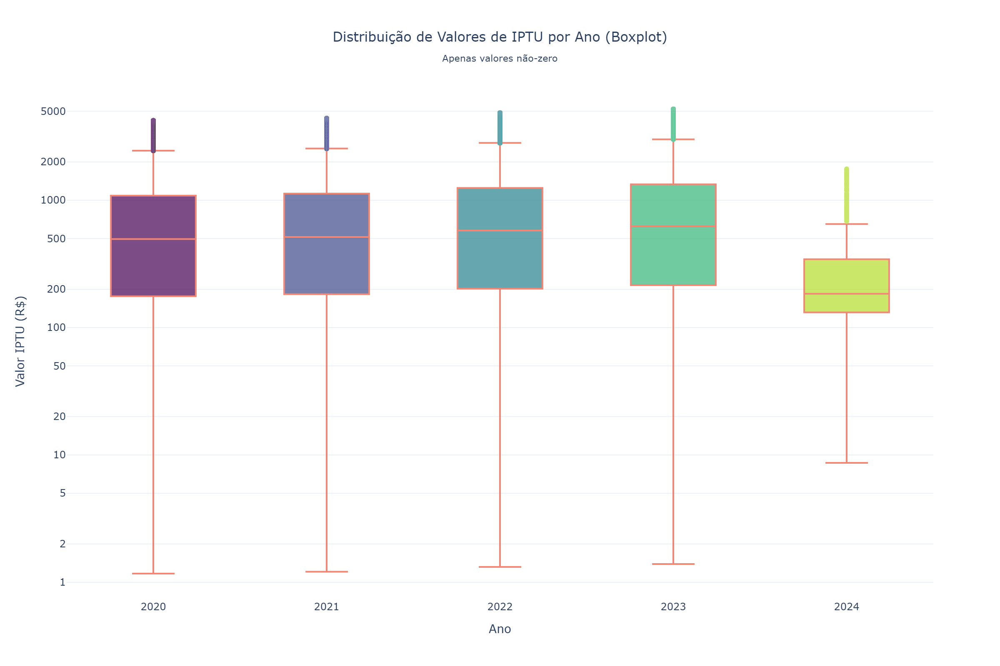](data/gold/plots/tax_trends.html)

**Top Bairros por IPTU** - Top 20 bairros por valor médio de IPTU

[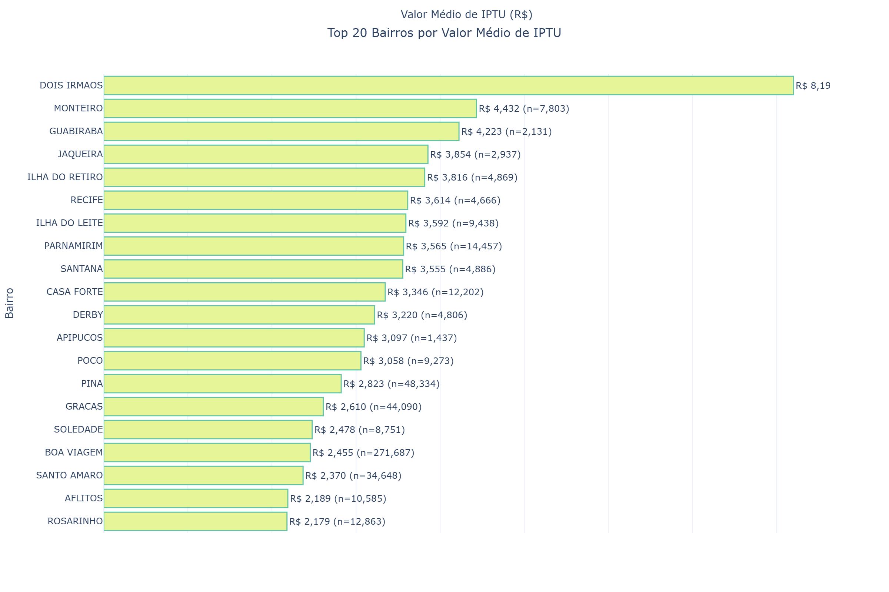](data/gold/plots/top_tax_neighborhoods.html)

#### 3. Análise de Idade de Construção

**Distribuição por Faixas de Idade** - Distribuição de imóveis por idade de construção

[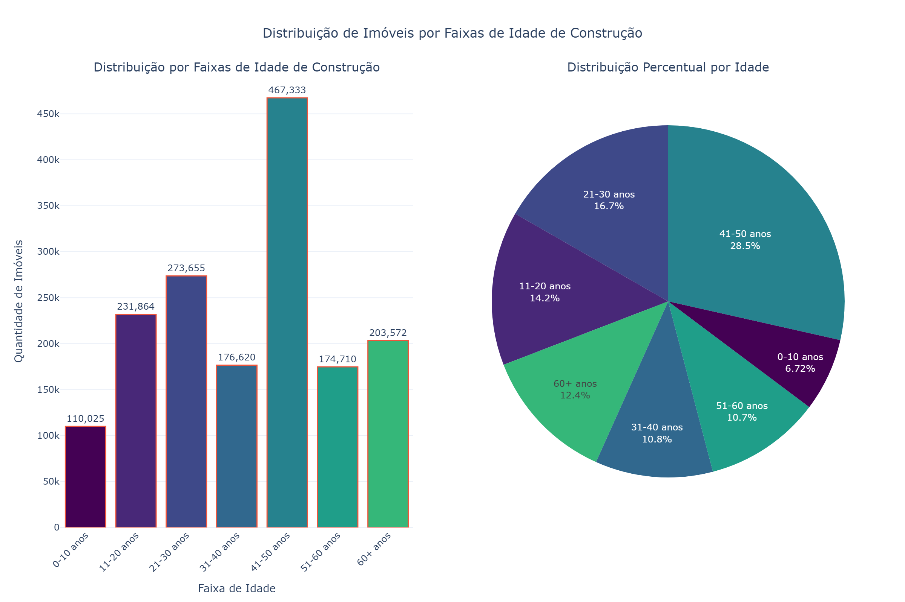](data/gold/plots/age_distribution.html)

**Relação Idade × Valor** - Valor médio de IPTU por faixa de idade de construção

[](data/gold/plots/age_value_relationship.html)

#### 4. Análise de Evolução de Bairros

**Crescimento em Quantidade** - Top bairros com maior crescimento em número de imóveis

[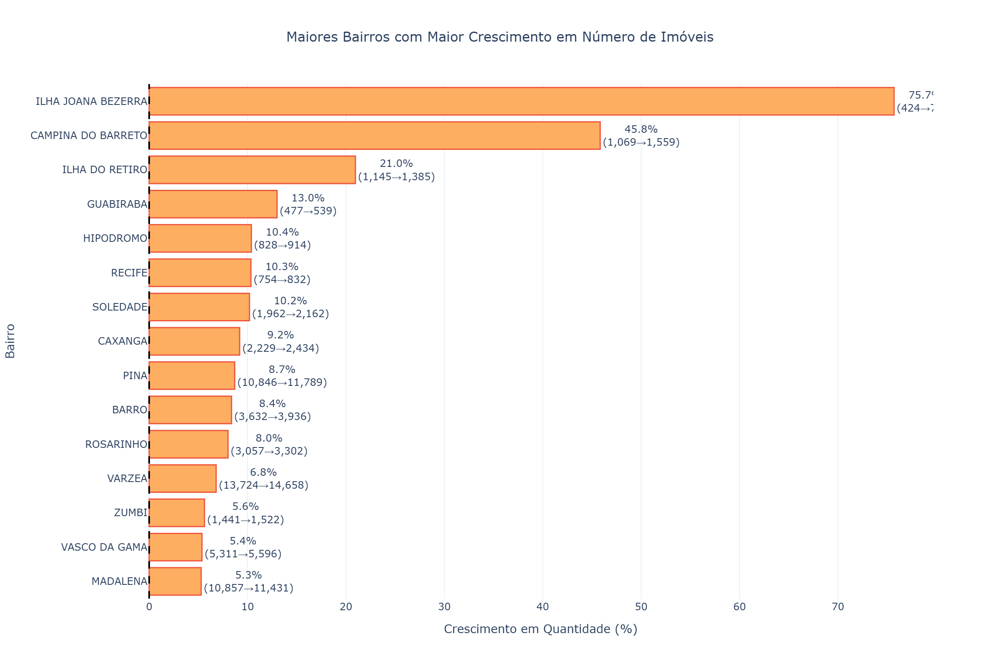](data/gold/plots/neighborhood_growth_quantity.html)

**Crescimento em Valor** - Top bairros com maior crescimento em valor médio de IPTU

[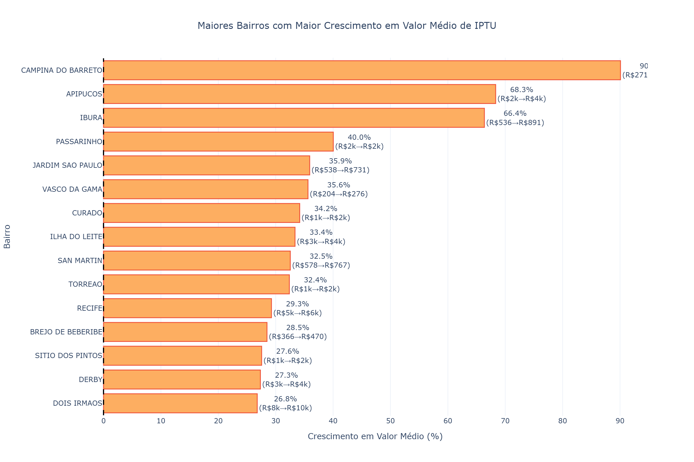](data/gold/plots/neighborhood_growth_value.html)

#### Relatório Completo

**Relatório HTML Interativo** - Todas as visualizações e análises em um único documento
- Visualização: [`visualizations_report.html`](data/gold/plots/visualizations_report.html)

> **Dica**: Clique em qualquer imagem acima para abrir a versão HTML interativa no navegador. Use zoom, hover e filtros para explorar os dados!

---

### Estrutura Completa das Análises

Todas as análises são salvas em `data/gold/analyses/` organizadas por categoria:

```
analyses/
├── volume_analysis/              # Análise de volume
│   ├── total_properties.csv
│   ├── volume_by_year.csv
│   ├── volume_by_type.csv
│   ├── volume_by_neighborhood.csv
│   ├── volume_by_year_type.csv
│   └── volume_by_year_neighborhood.csv
│
├── distribution_analysis/        # Análise de distribuição física
│   ├── distribution_by_type.csv
│   ├── distribution_by_neighborhood_top20.csv
│   ├── distribution_by_year.csv
│   ├── distribution_by_construction.csv
│   └── top_neighborhoods_by_year.csv
│
├── tax_value_analysis/           # Análise de valores de IPTU
│   ├── tax_stats_by_year.csv
│   ├── property_value_by_year.csv
│   └── avg_tax_by_neighborhood_top20.csv
│
├── age_analysis/                 # Análise de idade de construção
│   ├── age_distribution_by_range.csv
│   └── age_statistics.csv
│
├── age_value_analysis/           # Relação idade-valor
│   └── age_value_relationship.csv
│
└── evolution_analysis/           # Evolução de bairros
    ├── neighborhood_evolution.csv
    ├── top_growth_quantity.csv
    └── top_growth_value.csv
```

---

## Outputs

### Medallion Layers

| Layer | Location | Format | Description |
|-------|----------|--------|-------------|
| **Raw** | `data/raw/` | CSV/JSON | Source files |
| **Bronze** | `data/bronze/` | Delta/Parquet | Cleaned data |
| **Silver** | `data/silver/` | Delta/Parquet | Consolidated |
| **Gold** | `data/gold/` | CSV/PNG/HTML | Analytics |

### Analysis Results

`data/gold/analyses/` contém análises completas organizadas por categoria:

#### Volume Analysis (`volume_analysis/`)
- `total_properties.csv`: Total de imóveis (1.637.779)
- `volume_by_year.csv`: Volume por ano (2020-2024)
- `volume_by_type.csv`: Volume por tipo de uso do imóvel
- `volume_by_neighborhood.csv`: Volume por bairro
- `volume_by_year_type.csv`: Análise cruzada ano × tipo
- `volume_by_year_neighborhood.csv`: Análise cruzada ano × bairro

#### Distribution Analysis (`distribution_analysis/`)
- `distribution_by_type.csv`: Distribuição por tipo de uso
- `distribution_by_neighborhood_top20.csv`: Top 20 bairros
- `distribution_by_year.csv`: Distribuição temporal
- `distribution_by_construction.csv`: Por tipo de construção
- `top_neighborhoods_by_year.csv`: Top bairros por ano

#### Tax Value Analysis (`tax_value_analysis/`)
- `tax_stats_by_year.csv`: Estatísticas de IPTU por ano (média, mediana, min, max)
- `property_value_by_year.csv`: Valores de propriedade por ano
- `avg_tax_by_neighborhood_top20.csv`: Top 20 bairros por valor médio de IPTU

#### Age Analysis (`age_analysis/`)
- `age_distribution_by_range.csv`: Distribuição por faixas de idade (0-10, 11-20, etc.)
- `age_statistics.csv`: Estatísticas (média, mediana, min, max)

#### Age-Value Analysis (`age_value_analysis/`)
- `age_value_relationship.csv`: Relação entre idade de construção e valor de IPTU

#### Evolution Analysis (`evolution_analysis/`)
- `neighborhood_evolution.csv`: Evolução completa por bairro
- `top_growth_quantity.csv`: Top bairros com maior crescimento em quantidade
- `top_growth_value.csv`: Top bairros com maior crescimento em valor

### Visualizations

`data/gold/plots/` contém 12 visualizações interativas em formato HTML (Plotly) + relatório HTML:

#### Análise de Volume (6 visualizações)
1. [`volume_by_year.html`](data/gold/plots/volume_by_year.html) - Volume de imóveis por ano
2. [`volume_by_type.html`](data/gold/plots/volume_by_type.html) - Distribuição por tipo de uso
3. [`top_neighborhoods.html`](data/gold/plots/top_neighborhoods.html) - Top 20 bairros por quantidade
4. [`volume_by_year_type.html`](data/gold/plots/volume_by_year_type.html) - Evolução ano × tipo
5. [`distribution_by_construction.html`](data/gold/plots/distribution_by_construction.html) - Distribuição por tipo de construção
6. [`temporal_distribution.html`](data/gold/plots/temporal_distribution.html) - Distribuição temporal

#### Análise de Valores de IPTU (2 visualizações)
7. [`tax_trends.html`](data/gold/plots/tax_trends.html) - Tendências de valores de IPTU (Boxplot por ano)
8. [`top_tax_neighborhoods.html`](data/gold/plots/top_tax_neighborhoods.html) - Top 20 bairros por valor de IPTU

#### Análise de Idade de Construção (2 visualizações)
9. [`age_distribution.html`](data/gold/plots/age_distribution.html) - Distribuição por faixas de idade de construção
10. [`age_value_relationship.html`](data/gold/plots/age_value_relationship.html) - Relação entre idade de construção e valor de IPTU

#### Análise de Evolução de Bairros (2 visualizações)
11. [`neighborhood_growth_quantity.html`](data/gold/plots/neighborhood_growth_quantity.html) - Crescimento em número de imóveis por bairro
12. [`neighborhood_growth_value.html`](data/gold/plots/neighborhood_growth_value.html) - Crescimento em valor médio de IPTU por bairro

#### Relatório HTML
13. [`visualizations_report.html`](data/gold/plots/visualizations_report.html) - Relatório HTML interativo com todas as visualizações e tabelas detalhadas

> **Nota**: Todas as visualizações são geradas em formato HTML interativo usando Plotly. Abra os arquivos no navegador para explorar os dados com zoom, hover e filtros interativos.

### Legacy Outputs

`outputs/`:
- `validation_report.csv`: Validation summary
- `validation_errors.csv`: Detailed errors
- `medallion_validation_report.json`: Layer validation

### Catalog

`data/catalog/`:
- `data_catalog.json`: Human-readable metadata
- `data_catalog.parquet`: Queryable catalog
- `data_catalog_delta/`: Delta table catalog

---

## Advanced Features

### Delta Lake Features

1. **ACID Transactions**: Ensure data integrity
2. **Schema Evolution**: Add/rename columns without rewriting
3. **Column Mapping**: Handle special characters in column names
4. **Time Travel**: Query historical versions
5. **Partitioning**: Partition by year for performance

### PyDeequ Integration

Automated data quality checks:
- Completeness checks
- Anomaly detection
- Column profiling
- Constraint checks

### Catalog System

Centralized metadata tracking:
- File discovery timestamp
- MD5 checksum
- Processing status
- Schema snapshots
- Row/column counts

### Incremental Processing

Add new years without reprocessing:
1. Checks existing years in Silver layer
2. Only processes new years
3. Appends to existing data
4. Updates analyses

### Export Script

`export_refined_dataset.py`:
- Removes duplicates
- Filters metadata columns
- Normalizes timestamps
- Creates single Parquet file

---

## Next Steps

Future enhancements:
- [ ] Unit test coverage
- [ ] CI/CD pipeline
- [ ] Web dashboard deployment
- [ ] Database integration (PostgreSQL/MongoDB)
- [ ] Real-time streaming support (Kafka)
- [ ] ML model integration
- [ ] Cost optimization for Spark

---

**Built with love for the Neuro Tech Challenge**
